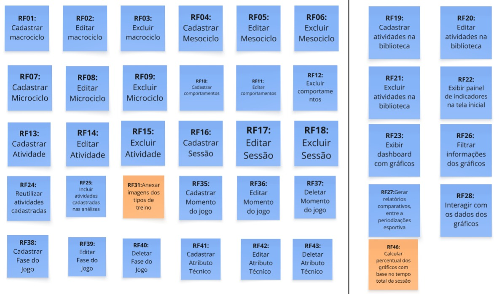

# 10 Backlog do Produto

Esta seção descreve o backlog de produto (preliminar ou completo, dependendo do produto), que é uma lista priorizada de todas as funcionalidades e melhorias planejadas para o software. Também aborda a priorização dessas funcionalidades e o que será entregue no Produto Mínimo Viável (MVP).

## 10.1 Backlog Geral

Aqui, cabe destacar que todas as histórias de usuários relacionadas, a seguir, são derivadas da lista de requisitos funcionais apresentados, anteriormente, neste documento. Esta é uma lista preliminar e deverá sofrer ajustes sempre que necessário, durante o desenvolvimento do produto FutBoard.

A tabela, a seguir, apresenta cada um dos requisitos funcionais (RFs) declarados utilizando a técnica de *User Story* (US), assim como a rastreabilidade com os requisitos não funcionais (RNFs).

| RF | User Story derivada | RNFs relacionados |
| :--- | :--- | :---: |
| **RF01** | **US01** Como treinador ou auxiliar, eu quero cadastrar um novo macrociclo com nome e data de início, para organizar o planejamento geral da periodização dos treinos. | RNF02, RNF03 |
| **RF02** | **US02** Como treinador ou auxiliar, eu quero editar os dados de um macrociclo, para corrigir informações ou atualizar o planejamento geral. | RNF02, RNF03 |
| **RF03** | **US03** Como treinador ou auxiliar, eu quero excluir um macrociclo, para remover estruturas de periodização que não serão mais utilizadas. | RNF02, RNF04 |
| **RF04** | **US04** Como treinador ou auxiliar, eu quero cadastrar um novo mesociclo vinculado a um macrociclo, para estruturar as fases intermediárias da periodização esportiva. | RNF02, RNF03 |
| **RF05** | **US05** Como treinador ou auxiliar, eu quero editar os dados de um mesociclo, para manter as fases do planejamento atualizadas. | RNF02, RNF03 |
| **RF06** | **US06** Como treinador ou auxiliar, eu quero excluir um mesociclo, para remover fases da periodização que foram canceladas. | RNF02, RNF04 |
| **RF07** | **US07** Como treinador ou auxiliar, eu quero cadastrar um novo microciclo vinculado a um mesociclo, para organizar a rotina de treinos. | RNF02, RNF03 |
| **RF08** | **US08** Como treinador ou auxiliar, eu quero editar um microciclo, para ajustar o planejamento de curto prazo conforme a necessidade da equipe. | RNF02, RNF03 |
| **RF09** | **US09** Como treinador ou auxiliar, eu quero excluir um microciclo, para descartar planejamentos inválidos. | RNF02, RNF04 |
| **RF10** | **US10** Como treinador ou auxiliar, eu quero cadastrar um comportamento tático (ex: ofensivo, defensivo), para vinculá-lo às atividades. | RNF02, RNF03 |
| **RF11** | **US11** Como treinador ou auxiliar, eu quero editar um comportamento tático, para corrigir sua nomenclatura ou ajustar os detalhes técnicos. | RNF02, RNF03 |
| **RF12** | **US12** Como treinador ou auxiliar, eu quero excluir um comportamento tático, para remover opções obsoletas. | RNF02, RNF04 |
| **RF13** | **US13** Como treinador ou auxiliar, eu quero cadastrar uma nova atividade informando sua tipologia e tipo de SSP, para estruturar os exercícios da equipe. | RNF02, RNF03 |
| **RF14** | **US14** Como treinador ou auxiliar, eu quero editar os dados invariáveis de uma atividade, para corrigir e atualizar detalhes do exercício. | RNF02, RNF03 |
| **RF15** | **US15** Como treinador ou auxiliar, eu quero excluir uma atividade cadastrada, para manter o banco de exercícios organizado. | RNF02, RNF04 |
| **RF16** | **US16** Como treinador ou auxiliar, eu quero cadastrar uma nova sessão de treino vinculada à periodização com data e sequência, para cadastrar as atividades de um dia específico. | RNF02, RNF03, RNF04 |
| **RF17** | **US17** Como treinador ou auxiliar, eu quero editar os dados de uma sessão de treino, para ajustar a data ou numeração do treino caso haja mudanças. | RNF02, RNF03, RNF04 |
| **RF18** | **US18** Como treinador ou auxiliar, eu quero excluir uma sessão de treino, para remover um treino. | RNF02, RNF04 |
| **RF19** | **US19** Como treinador ou auxiliar, eu quero cadastrar atividades diretamente na biblioteca de treinos, para deixá-las disponíveis para reutilização futura sem precisar atrelá-las imediatamente a uma sessão. | RNF02, RNF03 |
| **RF20** | **US20** Como treinador ou auxiliar, eu quero editar uma atividade na biblioteca de treinos, para melhorar ou corrigir a descrição base do exercício. | RNF02, RNF03 |
| **RF21** | **US21** Como treinador ou auxiliar, eu quero excluir uma atividade da biblioteca, para limpar exercícios não são mais utilizados. | RNF02, RNF04 |
| **RF22** | **US22** Como treinador ou auxiliar, eu quero visualizar indicadores de treino (número de sessões, minutos totais, variabilidade de exercícios, execuções), para acompanhar rapidamente o volume geral de trabalho. | RNF02, RNF04 |
| **RF23** | **US23** Como treinador ou auxiliar, eu quero adicionar a uma sessão uma atividade já existente na biblioteca com preenchimento automático de campos inerentes, para agilizar a montagem do treino. | RNF02, RNF03 |
| **RF24** | **US24** Como treinador ou auxiliar, eu quero filtrar as informações de atividade do treino, para consultar rapidamente um conjunto de atividades específicas executadas ou planejadas. | RNF02, RNF04 |
| **RF25** | **US25** Como treinador ou auxiliar, eu quero gerar um relatório da sessão em formato PDF, para imprimir e mostrar para comissão técnica. | RNF02, RNF04 |
| **RF26** | **US26** Como treinador ou auxiliar, eu quero alternar o tempo da atividade entre valor absoluto (minutos) e relativo (porcentagem), para entender melhor o peso do exercício no contexto geral da sessão. | RNF02, RNF04 |
| **RF27** | **US27** Como treinador ou auxiliar, eu quero criar uma conta de acesso na aplicação, para ter um perfil dedicado e seguro para gerenciar meu planejamento. | RNF01, RNF02 |
| **RF28** | **US28** Como treinador ou auxiliar, eu quero fazer login com e-mail e senha, para garantir que os dados sensíveis do time sejam acessados de forma autenticada. | RNF01, RNF02 |
| **RF29** | **US29** Como treinador ou auxiliar, eu quero anexar uma imagem à atividade na biblioteca, para saber qual atividade fiz. | RNF02, RNF03 |
| **RF30** | **US30** Como treinador ou auxiliar, eu quero registrar a pontuação planejada e a pontuação obtida em cada repetição da atividade, para monitorar a eficácia e o desempenho do grupo na execução. | RNF02, RNF03, RNF04 |
| **RF31** | **US31** Como treinador ou auxiliar, eu quero gerar insights e análises textuais com inteligência artificial, para obter resumos e observações aprofundadas sobre o andamento dos treinos. | RNF02, RNF04 |
| **RF32** | **US32** Como treinador ou auxiliar, eu quero registrar atributos técnicos em uma atividade (ex: domínio orientado), para mapear as habilidades fundamentais trabalhadas no exercício. | RNF02, RNF03 |
| **RF33** | **US33** Como treinador ou auxiliar, eu quero editar o atributo técnico de uma atividade, para refletir melhor o foco real do exercício. | RNF02, RNF03 |
| **RF34** | **US34** Como treinador ou auxiliar, eu quero excluir um atributo técnico registrado em uma atividade. | RNF02, RNF04 |
| **RF35** | **US35** Como treinador ou auxiliar, eu quero usar filtros para consultar informações sobre o espaço do treino, através dos gráficos. | RNF02, RNF04 |
| **RF36** | **US36** Como treinador ou auxiliar, eu quero usar filtros para consultar as orientações de treino, através dos gráficos para avaliar se o direcionamento planejado está adequado. | RNF02, RNF04 |
| **RF37** | **US37** Como treinador ou auxiliar, eu quero filtrar a informação por momento do jogo treinado, através dos gráficos para avaliar quais momentos de jogos foram abordados nos treinos. | RNF02, RNF04 |
| **RF38** | **US38** Como treinador ou auxiliar, eu quero filtrar a informação por fase de jogo, através dos gráficos para saber qual saber a fase do jogo associada a atividade. | RNF02, RNF04 |
| **RF39** | **US39** Como treinador ou auxiliar, eu quero filtrar as informações de treino por comportamento, através dos gráficos para saber o quanto trabalhei os comportamentos distintos. | RNF02, RNF04 |
| **RF40** | **US40** Como treinador ou auxiliar, eu quero filtrar informações por atributo técnico, através dos gráficos para saber o quanto trabalhei esse atributo. | RNF02, RNF04 |
| **RF41** | **US41** Como treinador ou auxiliar, eu quero realizar uma análise comparativa através dos gráficos de periodização (meso, micro, mês, sessão). | RNF02, RNF04 |

> **Observação:** O **RNF02 (Interface Responsiva e Adaptável)** e o **RNF03 (Eficiência no Cadastro de Treinos)** aplicam-se de forma transversal a quase todas as interfaces e fluxos de cadastro da aplicação, assegurando que o tempo de registro de treinos pelo treinador seja inferior a 2 minutos e utilizável em qualquer dispositivo (desktop, tablet e mobile). O **RNF04 (Atualização em Tempo Real do Dashboard)** aplica-se transversalmente a todas as operações de cadastro, edição ou exclusão de ciclos, sessões e atividades que reflitam em métricas visuais, garantindo atualização em até 5 segundos. O **RNF01 (Proteção de Dados Pessoais dos Atletas)** relaciona-se diretamente com o módulo de autenticação e perfis de acesso (RF29 e RF30), e ambos foram postergados para entregas futuras.

## 10.2 Priorização do Backlog Geral e MVP

Para priorizar o backlog do FutBoard, cada requisito funcional (RF) recebeu quatro notas: **valor de negócio**, **esforço**, **complexidade** e **conhecimento da equipe**. As três últimas foram combinadas em uma única medida, o **esforço técnico**, que foi cruzada com o valor de negócio para posicionar cada RF em um quadrante da matriz Valor x Esforço.

### 1. Critérios e legendas

#### 1.1 Valor de negócio

O valor de negócio foi definido a partir da justificativa dada pelo cliente para cada funcionalidade.

| Pontuação | Interpretação | Justificativa do cliente |
|:---:|---|---|
| 4 | Essencial | O sistema necessita dessa funcionalidade. |
| 3 | Muito valioso | Agrega muito valor ao produto e deve ser priorizado. |
| 2 | Desejável | Seria interessante ter, mas o sistema funciona perfeitamente sem. |
| 1 | A definir | Nota ainda não utilizada no backlog atual. |

#### 1.2 Esforço

| Pontuação | Interpretação | Descrição |
|:---:|---|---|
| 1 | Esforço baixo | Até 2 horas |
| 2 | Esforço moderado | Entre 2 e 6 horas |
| 3 | Esforço alto | Entre 6 e 12 horas |
| 4 | Esforço muito alto | Mais de 12 horas |

#### 1.3 Complexidade

| Pontuação | Interpretação |
|:---:|---|
| 1 | Operações cadastrais elementares (CRUD direto) em entidades isoladas, com validações de formato padronizadas, sem dependências de fluxo ou cálculos. Atividades com consumo de dados do banco. |
| 2 | Operações com dependência hierárquica (efeitos em cascata), integridade referencial estrita, upload de arquivos ou manipulação de coleções locais. |
| 3 | Lógica de negócio analítica, processamento em tempo de execução, cálculos derivados e reatividade/interdependência entre múltiplos componentes visuais. |
| 4 | Requisitos com alta incerteza técnica, algoritmos pesados de inferência/estatística ou dependência crítica de serviços/APIs externas de terceiros. |

#### 1.4 Conhecimento da equipe

| Pontuação | Interpretação |
|:---:|---|
| 1 | A equipe domina plenamente os conhecimentos necessários. |
| 2 | A equipe possui conhecimento suficiente, com pouca aprendizagem adicional. |
| 3 | A equipe precisa desenvolver conhecimentos relevantes. |
| 4 | A equipe ainda não possui os conhecimentos ou recursos necessários. |

### 2. Como as notas foram definidas: votação e média

As notas de esforço, complexidade e conhecimento da equipe não foram decididas por uma pessoa só. Para cada critério de cada requisito, todos os seis membros da equipe votaram individualmente, usando as legendas acima, e a nota final foi a **média dos votos**, arredondada para o inteiro mais próximo (valores com 0,5 sobem para o inteiro seguinte).

Exemplo de votação para um critério de um requisito:

| Membro | Voto |
|---|:---:|
| Giovana | 3 |
| Guilherme L. | 3 |
| Guilherme T. | 2 |
| Gustavo | 2 |
| Leonardo | 3 |
| Rafael | 2 |
| **Média** | **2,5 → 3** |

Cálculo: (3 + 3 + 2 + 2 + 3 + 2) / 6 = 2,5, arredondado para **3**.

### 3. Esforço técnico

O esforço técnico resume o custo de desenvolvimento de um RF em um único número, entre 1 e 4, calculado como a média simples das três notas finais:

```
Esforço técnico = (Esforço + Complexidade + Conhecimento da equipe) / 3
```

Exemplo com o RF34 (Gerar análises textuais dos dados cadastrados, com IA): (3 + 4 + 4) / 3 = 3,67.

### 4. Matriz Valor x Esforço e quadrantes

Cada RF é posicionado em um quadrante comparando o **valor de negócio** com o **esforço técnico**, tendo 2 como ponto de corte nos dois eixos.

| Quadrante | Regra | Leitura | Prioridade sugerida |
|:---:|---|---|:---:|
| Q2 | Valor > 2 e esforço técnico <= 2 | Alto valor / Baixa carga técnica | Prioridade 1 |
| Q1 | Valor > 2 e esforço técnico > 2 | Alto valor / Alta carga técnica | Prioridade 2 |
| Q3 | Valor <= 2 e esforço técnico <= 2 | Baixo valor / Baixa carga técnica | Prioridade 3 |
| Q4 | Valor <= 2 e esforço técnico > 2 | Baixo valor / Alta carga técnica | Prioridade 4 |

A classificação foi automatizada na planilha com a fórmula abaixo, em que a coluna C guarda o valor de negócio e a coluna H o esforço técnico:

```excel
=MAP(C3:C500; H3:H500; LAMBDA(val; esf;
  SE(esf=""; "";
  IFS(
    (esf>2)*(val>2);   "Quadrante 1";
    (esf<=2)*(val>2);  "Quadrante 2";
    (esf<=2)*(val<=2); "Quadrante 3";
    (esf>2)*(val<=2);  "Quadrante 4"
  ))
))
```


[Acessar a matriz no Miro](https://miro.com/welcomeonboard/YmN1NWlzM0VXeDkyTkhySndlQ3V3UTlqdmJlVDdDdnF1dmdjREpGVTdkb3RJeVptV20xYzlyTVJzd3hZNFpWdHFsVmNtMDQ5eGZIRm0rYzNCSnNybGhSYmFuVXJ3ZGdQZEkxSDRhZ3hjQ2RNK3A4TTZzNmVtUXdEVElpTjkyNFVyVmtkMG5hNDA3dVlncnBvRVB2ZXBnPT0hdjE=?share_link_id=122393869978)


### 5. Consolidação dos requisitos

<table class="tabela-consolidacao-html">
<thead><tr><th>Código</th><th>Requisito</th><th>Valor</th><th>Frequência</th><th>Esforço</th><th>Complexidade</th><th>Conhecimento</th><th>Esforço técnico</th><th>Quadrante</th></tr></thead>
<tbody>
<tr><td>RF01</td><td>Cadastrar macrociclo</td><td>4,00</td><td>2,00</td><td>2,00</td><td>2,00</td><td>2,00</td><td>2,00</td><td>Q2 Alto valor / Baixa carga técnica</td></tr>
<tr><td>RF02</td><td>Editar macrociclo</td><td>4,00</td><td>5,00</td><td>2,00</td><td>2,00</td><td>2,00</td><td>5,00</td><td>Q2 Alto valor / Baixa carga técnica</td></tr>
<tr><td>RF03</td><td>Excluir macrociclo</td><td>4,00</td><td>2,00</td><td>2,00</td><td>2,00</td><td>2,00</td><td>2,00</td><td>Q2 Alto valor / Baixa carga técnica</td></tr>
<tr><td>RF04</td><td>Cadastrar mesociclo</td><td>4,00</td><td>3,00</td><td>2,00</td><td>2,00</td><td>2,00</td><td>3,00</td><td>Q2 Alto valor / Baixa carga técnica</td></tr>
<tr><td>RF05</td><td>Editar mesociclo</td><td>4,00</td><td>3,00</td><td>2,00</td><td>2,00</td><td>2,00</td><td>3,00</td><td>Q2 Alto valor / Baixa carga técnica</td></tr>
<tr><td>RF06</td><td>Excluir mesociclo</td><td>4,00</td><td>2,00</td><td>2,00</td><td>2,00</td><td>2,00</td><td>2,00</td><td>Q2 Alto valor / Baixa carga técnica</td></tr>
<tr><td>RF07</td><td>Cadastrar microciclo</td><td>4,00</td><td>4,00</td><td>2,00</td><td>2,00</td><td>2,00</td><td>4,00</td><td>Q2 Alto valor / Baixa carga técnica</td></tr>
<tr><td>RF08</td><td>Editar microciclo</td><td>4,00</td><td>4,00</td><td>2,00</td><td>2,00</td><td>2,00</td><td>4,00</td><td>Q2 Alto valor / Baixa carga técnica</td></tr>
<tr><td>RF09</td><td>Excluir microciclo</td><td>4,00</td><td>2,00</td><td>2,00</td><td>2,00</td><td>2,00</td><td>2,00</td><td>Q2 Alto valor / Baixa carga técnica</td></tr>
<tr><td>RF10</td><td>Cadastrar comportamentos</td><td>4,00</td><td>5,00</td><td>2,00</td><td>2,00</td><td>2,00</td><td>5,00</td><td>Q2 Alto valor / Baixa carga técnica</td></tr>
<tr><td>RF11</td><td>Editar comportamentos</td><td>4,00</td><td>5,00</td><td>2,00</td><td>2,00</td><td>2,00</td><td>5,00</td><td>Q2 Alto valor / Baixa carga técnica</td></tr>
<tr><td>RF12</td><td>Excluir comportamentos</td><td>4,00</td><td>2,00</td><td>2,00</td><td>2,00</td><td>2,00</td><td>2,00</td><td>Q2 Alto valor / Baixa carga técnica</td></tr>
<tr><td>RF13</td><td>Cadastrar atividade</td><td>4,00</td><td>5,00</td><td>2,00</td><td>2,00</td><td>2,00</td><td>5,00</td><td>Q2 Alto valor / Baixa carga técnica</td></tr>
<tr><td>RF14</td><td>Editar atividade</td><td>4,00</td><td>5,00</td><td>2,00</td><td>2,00</td><td>2,00</td><td>5,00</td><td>Q2 Alto valor / Baixa carga técnica</td></tr>
<tr><td>RF15</td><td>Excluir atividade</td><td>4,00</td><td>2,00</td><td>2,00</td><td>2,00</td><td>2,00</td><td>2,00</td><td>Q2 Alto valor / Baixa carga técnica</td></tr>
<tr><td>RF16</td><td>Cadastrar sessão</td><td>4,00</td><td>5,00</td><td>2,00</td><td>2,00</td><td>2,00</td><td>5,00</td><td>Q2 Alto valor / Baixa carga técnica</td></tr>
<tr><td>RF17</td><td>Editar sessão</td><td>4,00</td><td>5,00</td><td>2,00</td><td>2,00</td><td>2,00</td><td>5,00</td><td>Q2 Alto valor / Baixa carga técnica</td></tr>
<tr><td>RF18</td><td>Excluir sessão</td><td>4,00</td><td>2,00</td><td>2,00</td><td>2,00</td><td>2,00</td><td>2,00</td><td>Q2 Alto valor / Baixa carga técnica</td></tr>
<tr><td>RF19</td><td>Cadastrar atividades na biblioteca</td><td>4,00</td><td>5,00</td><td>3,00</td><td>3,00</td><td>3,00</td><td>5,00</td><td>Q1 Alto valor / Alta carga técnica</td></tr>
<tr><td>RF20</td><td>Editar atividades na biblioteca</td><td>4,00</td><td>5,00</td><td>3,00</td><td>3,00</td><td>3,00</td><td>5,00</td><td>Q1 Alto valor / Alta carga técnica</td></tr>
<tr><td>RF21</td><td>Excluir atividades na biblioteca</td><td>4,00</td><td>2,00</td><td>3,00</td><td>3,00</td><td>3,00</td><td>2,00</td><td>Q1 Alto valor / Alta carga técnica</td></tr>
<tr><td>RF22</td><td>Exibir indicador de treino</td><td>4,00</td><td>5,00</td><td>2,00</td><td>2,00</td><td>3,00</td><td>5,00</td><td>Q1 Alto valor / Alta carga técnica</td></tr>
<tr><td>RF23</td><td>Reutilizar atividades cadastradas</td><td>4,00</td><td>5,00</td><td>2,00</td><td>2,00</td><td>2,00</td><td>5,00</td><td>Q2 Alto valor / Baixa carga técnica</td></tr>
<tr><td>RF24</td><td>Consultar informação de atividade do treino</td><td>4,00</td><td>5,00</td><td>3,00</td><td>3,00</td><td>3,00</td><td>5,00</td><td>Q1 Alto valor / Alta carga técnica</td></tr>
<tr><td>RF25</td><td>Gerar relatórios de treino (PDF)</td><td>4,00</td><td>5,00</td><td>4,00</td><td>4,00</td><td>4,00</td><td>5,00</td><td>Q1 Alto valor / Alta carga técnica</td></tr>
<tr><td>RF26</td><td>Alternar unidade de tempo</td><td>4,00</td><td>5,00</td><td>2,00</td><td>2,00</td><td>2,00</td><td>5,00</td><td>Q2 Alto valor / Baixa carga técnica</td></tr>
<tr><td>RF27</td><td>Criar conta</td><td>2,00</td><td>5,00</td><td>2,00</td><td>3,00</td><td>2,00</td><td>5,00</td><td>Q4 Baixo valor / Alta carga técnica</td></tr>
<tr><td>RF28</td><td>Fazer login</td><td>2,00</td><td>5,00</td><td>2,00</td><td>3,00</td><td>2,00</td><td>5,00</td><td>Q4 Baixo valor / Alta carga técnica</td></tr>
<tr><td>RF29</td><td>Anexar imagens dos tipos de treino</td><td>3,00</td><td>5,00</td><td>2,00</td><td>2,00</td><td>2,00</td><td>5,00</td><td>Q2 Alto valor / Baixa carga técnica</td></tr>
<tr><td>RF30</td><td>Registrar pontuações de cada exercício</td><td>2,00</td><td>5,00</td><td>2,00</td><td>2,00</td><td>2,00</td><td>5,00</td><td>Q3 Baixo valor / Baixa carga técnica</td></tr>
<tr><td>RF31</td><td>Gerar análises textuais dos dados cadastrados (com IA)</td><td>3,00</td><td>5,00</td><td>3,00</td><td>4,00</td><td>4,00</td><td>5,00</td><td>Q1 Alto valor / Alta carga técnica</td></tr>
<tr><td>RF32</td><td>Registrar atributo técnico da atividade</td><td>4,00</td><td>5,00</td><td>2,00</td><td>2,00</td><td>2,00</td><td>5,00</td><td>Q2 Alto valor / Baixa carga técnica</td></tr>
<tr><td>RF33</td><td>Editar atributo técnico da atividade</td><td>4,00</td><td>2,00</td><td>2,00</td><td>2,00</td><td>2,00</td><td>2,00</td><td>Q2 Alto valor / Baixa carga técnica</td></tr>
<tr><td>RF34</td><td>Excluir atributo técnico da atividade</td><td>4,00</td><td>2,00</td><td>2,00</td><td>2,00</td><td>2,00</td><td>2,00</td><td>Q2 Alto valor / Baixa carga técnica</td></tr>
<tr><td>RF35</td><td>Consultar informação de espaço do treino</td><td>4,00</td><td>5,00</td><td>2,00</td><td>3,00</td><td>2,00</td><td>5,00</td><td>Q1 Alto valor / Alta carga técnica</td></tr>
<tr><td>RF36</td><td>Consultar informação de orientação do treino</td><td>4,00</td><td>5,00</td><td>2,00</td><td>3,00</td><td>2,00</td><td>5,00</td><td>Q1 Alto valor / Alta carga técnica</td></tr>
<tr><td>RF37</td><td>Consultar informação de momento do jogo do treino</td><td>4,00</td><td>5,00</td><td>3,00</td><td>3,00</td><td>3,00</td><td>5,00</td><td>Q1 Alto valor / Alta carga técnica</td></tr>
<tr><td>RF38</td><td>Consultar informação de fase do jogo do treino</td><td>4,00</td><td>5,00</td><td>3,00</td><td>3,00</td><td>3,00</td><td>5,00</td><td>Q1 Alto valor / Alta carga técnica</td></tr>
<tr><td>RF39</td><td>Consultar informação de comportamento do treino</td><td>4,00</td><td>5,00</td><td>3,00</td><td>3,00</td><td>3,00</td><td>5,00</td><td>Q1 Alto valor / Alta carga técnica</td></tr>
<tr><td>RF40</td><td>Consultar informação de atributo técnico do treino</td><td>4,00</td><td>5,00</td><td>3,00</td><td>3,00</td><td>3,00</td><td>5,00</td><td>Q1 Alto valor / Alta carga técnica</td></tr>
<tr><td>RF41</td><td>Consultar análise comparativa por periodização</td><td>4,00</td><td>5,00</td><td>4,00</td><td>3,00</td><td>3,00</td><td>5,00</td><td>Q1 Alto valor / Alta carga técnica</td></tr>
</tbody>
</table>


### 6. Requisitos do MVP

#### Requisitos Funcionais (RFs)

A definição dos Requisitos Funcionais que compõem o MVP foi realizada previamente com base na matriz de valor x esforço e posteriormente validada diretamente com o cliente via WhatsApp (conforme detalhado na [Seção 10.3](#103-validacao-do-backlog-e-escopo-do-mvp-com-o-cliente)). Foram selecionados tanto os requisitos de **alto valor e baixo esforço** quanto os requisitos de **alto valor e alto esforço**, que juntos compõem o escopo funcional do MVP. Em contrapartida, ficaram fora do MVP os requisitos categorizados como de **baixo valor e baixo esforço** ou de **baixo valor e alto esforço**.

| Código | Requisito | Classificação |
|:---:|---|---|
| RF01 | Cadastrar macrociclo | Q2 - Alto valor / Baixo esforço |
| RF02 | Editar macrociclo | Q2 - Alto valor / Baixo esforço |
| RF03 | Excluir macrociclo | Q2 - Alto valor / Baixo esforço |
| RF04 | Cadastrar mesociclo | Q2 - Alto valor / Baixo esforço |
| RF05 | Editar mesociclo | Q2 - Alto valor / Baixo esforço |
| RF06 | Excluir mesociclo | Q2 - Alto valor / Baixo esforço |
| RF07 | Cadastrar microciclo | Q2 - Alto valor / Baixo esforço |
| RF08 | Editar microciclo | Q2 - Alto valor / Baixo esforço |
| RF09 | Excluir microciclo | Q2 - Alto valor / Baixo esforço |
| RF10 | Cadastrar comportamentos | Q2 - Alto valor / Baixo esforço |
| RF11 | Editar comportamentos | Q2 - Alto valor / Baixo esforço |
| RF12 | Excluir comportamentos | Q2 - Alto valor / Baixo esforço |
| RF13 | Cadastrar atividade | Q2 - Alto valor / Baixo esforço |
| RF14 | Editar atividade | Q2 - Alto valor / Baixo esforço |
| RF15 | Excluir atividade | Q2 - Alto valor / Baixo esforço |
| RF16 | Cadastrar sessão | Q2 - Alto valor / Baixo esforço |
| RF17 | Editar sessão | Q2 - Alto valor / Baixo esforço |
| RF18 | Excluir sessão | Q2 - Alto valor / Baixo esforço |
| RF24 | Reutilizar atividades cadastradas | Q2 - Alto valor / Baixo esforço |
| RF25 | Incluir atividades cadastradas nas análises | Q2 - Alto valor / Baixo esforço |
| RF31 | Anexar imagens dos tipos de treino | Q2 - Alto valor / Baixo esforço |
| RF35 | Cadastrar momento do jogo | Q2 - Alto valor / Baixo esforço |
| RF36 | Editar momento do jogo | Q2 - Alto valor / Baixo esforço |
| RF37 | Deletar momento do jogo | Q2 - Alto valor / Baixo esforço |
| RF38 | Cadastrar fase do jogo | Q2 - Alto valor / Baixo esforço |
| RF39 | Editar fase do jogo | Q2 - Alto valor / Baixo esforço |
| RF40 | Deletar fase do jogo | Q2 - Alto valor / Baixo esforço |
| RF41 | Cadastrar atributo técnico | Q2 - Alto valor / Baixo esforço |
| RF42 | Editar atributo técnico | Q2 - Alto valor / Baixo esforço |
| RF43 | Deletar atributo técnico | Q2 - Alto valor / Baixo esforço |
| RF19 | Cadastrar atividades na biblioteca | Q1 - Alto valor / Alto esforço |
| RF20 | Editar atividades na biblioteca | Q1 - Alto valor / Alto esforço |
| RF21 | Excluir atividades na biblioteca | Q1 - Alto valor / Alto esforço |
| RF22 | Exibir painel de indicadores na tela inicial | Q1 - Alto valor / Alto esforço |
| RF23 | Exibir dashboard com gráficos | Q1 - Alto valor / Alto esforço |
| RF26 | Filtrar informações dos gráficos | Q1 - Alto valor / Alto esforço |
| RF27 | Gerar relatórios comparativos entre periodizações esportivas | Q1 - Alto valor / Alto esforço |
| RF28 | Interagir com os dados dos gráficos | Q1 - Alto valor / Alto esforço |
| RF34 | Gerar análises textuais dos dados cadastrados (com IA) | Q1 - Alto valor / Alto esforço |
| RF46 | Calcular percentual dos gráficos com base no tempo total da sessão | Q1 - Alto valor / Alto esforço |

#### Requisitos Não Funcionais (RNFs)

Os Requisitos Não Funcionais não entram diretamente na matriz de esforço/valor padrão, pois são aplicáveis de forma transversal ao produto e não representam funcionalidades isoladas. Entretanto, os requisitos compreendidos entre o RNF02 e o RNF04, especificamente o **RNF02**, o **RNF03** e o **RNF04**, foram incorporados ao escopo do MVP por serem essenciais para a usabilidade, eficiência no registro de treinos e atualização dos dados em tempo real.

| Código | Requisito |
|:---:|---|
| RNF02 | Interface Responsiva e Adaptável |
| RNF03 | Eficiência no Cadastro de Treinos |
| RNF04 | Atualização em Tempo Real do Dashboard |

## 10.3 Validação do Backlog e Escopo do MVP com o Cliente

Após a priorização preliminar do backlog por meio da matriz Valor x Esforço e a consolidação dos requisitos nos quadrantes, a equipe realizou a **validação do backlog e da delimitação do MVP diretamente com o cliente** (o técnico Marcus Vinicius).

Via Whatsapp, a equipe utilizou e encaminhou ao cliente a imagem **`evidenciaValidacaoMVP`** (armazenada na pasta `assets` e ilustrada a seguir), contendo a organização visual dos cartões de requisitos levantados para o MVP.

<figure markdown="span" style="text-align: center; margin: 1.5em 0;">
  { width="85%" style="border-radius: 6px; box-shadow: 0 4px 10px rgba(0,0,0,0.08);" }
  <figcaption>Figura: Evidência da validação do backlog e escopo do MVP com o cliente via WhatsApp (artefato <code>evidenciaValidacaoMVP</code>)</figcaption>
</figure>

A imagem reflete a disposição dos requisitos funcionais priorizados, organizada em dois grandes grupos separados pela linha vertical:

- **Lado esquerdo (Quadrante Q2 — Alto Valor / Baixo Esforço):** reúne os cartões azuis com as funcionalidades cadastrais e operacionais estruturantes, como o gerenciamento dos ciclos de periodização (macrociclo, mesociclo e microciclo — RF01 a RF09), definição de comportamentos táticos (RF10 a RF12), fluxo de atividades e sessões de treino (RF13 a RF18), reutilização e customização de atividades (RF24 e RF25), categorização por momentos de jogo, fases de jogo e atributos técnicos (RF35 a RF43) e a inclusão de imagens nos tipos de treino (RF31, em cartão laranja de destaque).
- **Lado direito (Quadrante Q1 — Alto Valor / Alto Esforço):** engloba as funcionalidades de biblioteca e visualização analítica, incluindo a biblioteca de atividades (RF19 a RF21), o painel de indicadores da tela inicial (RF22), o dashboard com gráficos analíticos (RF23), as capacidades de filtragem, relatórios comparativos e interatividade (RF26 a RF28), além do cálculo percentual proporcional ao tempo total da sessão (RF46, também em cartão laranja de destaque).

Durante a validação via WhatsApp, o treinador Marcus Vinicius avaliou o quadro apresentado na imagem e confirmou que o conjunto de requisitos selecionado contempla com fidelidade as necessidades prioritárias para o MVP do FutBoard.
