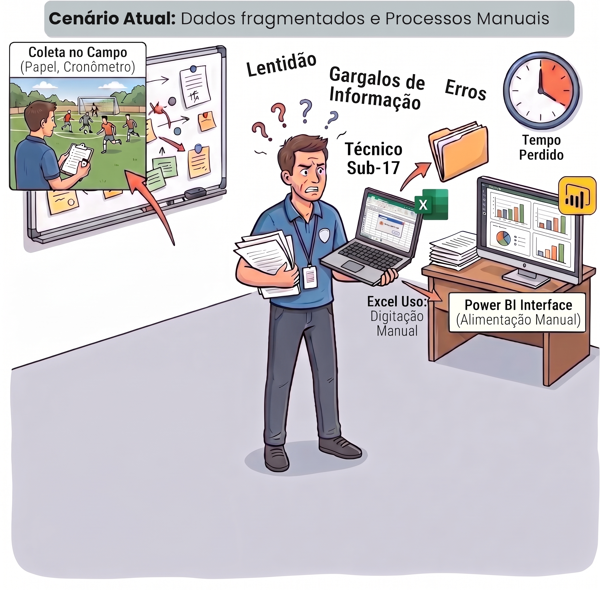
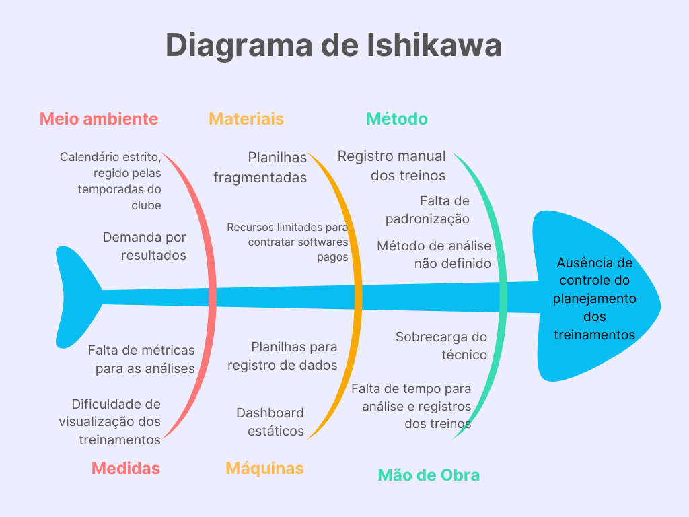

#Cenário Atual do Cliente e do Negócio

##1.1 Identificação do Cliente/Parceiro
- Nome: Marcus Vinicius Rodrigues 
- Tipo:  Clube esportivo (categoria de base — futebol) - Canaã Esporte Clube 
- Representante: Marcus Vinicius Rodrigues
- Forma de contato: Contato rápido por  WhatsApp, reuniões periódicas feitas pelo Teams.
- Vínculo com o projeto: Cliente direto, principal contato, responsável por informar os requisitos do produto, autorizar e validar as entregas.

##1.2 Introdução ao Negócio e Contexto

O Canaã Esporte Clube atua na formação de atletas de futebol, com foco na categoria de base Sub-17. O público-alvo direto da aplicação é o técnico responsável por planejar, executar e avaliar e gerenciar os treinamentos ao longo da temporada esportiva composta por cerca de 34 atletas e com treinos diários, com horários e durações variadas. 

Atualmente, o técnico representado pelo cliente Marcus Vinicius Rodrigues registra seus treinos em planilhas do Excel de forma manual, densa e pouco intuitiva, coletando dados no campo e digitando-os um a um após as sessões. Após o preenchimento, ele utiliza filtros que relacionam as tabelas para alimentar dashboards estáticos no PowerBI usados na análise de cada treino. Todo esse processo gera uma sobrecarga no cadastramento dos dados devido ao calendário apertado do clube e à demanda por resultados, já que esse volume de inserção diária consome horas do seu tempo extracampo. 

##1.3 Rich Picture
<figure>
  
  <figcaption>Figura 1: Rich Picture do sistema FutBoard</figcaption>
</figure>
##1.4 Identificação da Oportunidade ou Problema

O projeto surge da necessidade de solucionar a dificuldade do controle dos planejamentos dos treinamentos da equipe. Esse problema é potencializado por um ambiente esportivo desafiador, marcado por um calendário estrito e por uma constante demanda por resultados. Atualmente o acompanhamento da equipe é realizado por meio de planilhas fragmentadas e dashboards estáticos. Esse registro manual dos treinos junto à falta de padronização e a ausência de um método de análise bem definido causam sobrecarga do técnico, que esbarra na falta de tempo para análise e registro dos treinos. Com falta de métricas para as análises e a dificuldade de visualização global dos treinamentos dificultam a avaliação da efetividade e da distribuição das cargas de treino ao longo da temporada, prejudicando decisões técnicas que deveriam ser fundamentadas em dados. O nosso projeto atua como uma ferramenta estruturada para mitigar essas dores operacionais do cliente.

<figure>
  
  <figcaption>Figura 2: Diagrama de Ishikawa</figcaption>
</figure>

##1.5 Desafios do Projeto
- Estruturar os conceitos de periodização esportiva (macrociclos, mesociclos, microciclos).
- Processar automaticamente os dados registrados em relatórios estatísticos e gráficos interativos
- Garantir usabilidade para um usuário não necessariamente técnico em tecnologia (o treinador)
- Desafio técnicos acerca das tecnologias que o time de desenvolvimento utilizará para criar as análises e gráficos.
- Migrar, importar os dados já existentes das planilhas de Excel atuais do treinador para o novo sistema, assegurando que os dados não sejam perdidos durante a transição.
- Privacidade e proteção de dados tendo em vista que serão armazenado dados relacionados a jogadores menores de idade. 
- Observar as exigências aplicáveis da LGPD

##1.6 Mapa de Stakeholders

**1. Marcus Vinicius Rodrigues(Técnico do sub-17 e Cliente Direto):** É o representante do Canaã Esporte Clube, atuando como técnico da equipe Sub-17 e principal contato do projeto.

- **Relação:** É o público-alvo direto e usuário principal, será quem vai utilizar da aplicação diariamente para registrar, analisar, planejar, executar e avaliar os treinamentos esportivos.

- **Interesse e Expectativa:** Tem o interesse de solucionar a sobrecarga causada pelo registro manual fragmentado em planilhas e pela lentidão dos dashboards estáticos.  Espera obter um sistema com dashboards em tempo real, geração automatizada de relatórios, onde consiga obter o controle do planejamento de seus treinamentos estruturado cientificamente na periodização esportiva (macro, meso e microciclos). Possui uma familiaridade mediana com o uso de soluções digitais.

- **Nível de Influência:** Figura principal, é o grande decisor do projeto. Ele autoriza e valida as entregas.

 **2. Auxilar técnico:** O profissional que auxilia o técnico em seus treinos.

- **Relação:** Público secundário da aplicação, usuário direto. Ele poderá visualizar e cadastrar dados de treino.

- **Interesse e Expectativa:** Têm interesse em realizar análises estatísticas por meio de relatórios e gráficos interativos.  

- **Nível de Influência:** Participa do uso da aplicação, mas não participa das validações.

**3. Jogadores (Atletas do sub-17):** Os jovens atletas em formação no clube pertecem a faixa etária de 16-17 anos.

- **Relação:** São a origem das coletas de dados e o foco central das informações armazenadas no sistema (conforme apontado no fluxograma de oportunidades do projeto).

- **Interesses e Expectativas:** Embora não interajam com o sistema, dependem de um bom acompanhamento automatizado para terem seu desempenho e cargas avaliados corretamente ao longo das temporadas, os atletas tem uma rotatividade mediana por ser um clube de base.

- **Nível de Influência:** Baixa influência sobre o desenvolvimento ou decisão de uso da ferramenta. No entanto, são o grupo que será diretamente impactado pelas tomadas de decisões técnicas que o treinador fará com base nas análises geradas pelo produto.

**4. Preparador físico:** O profissional responsável pelo condicionamento físico, prevenção de lesões e reabilitação dos atletas.

- **Relação:** Público terciário da aplicação, usuário indireto. Não terá acesso à plataforma, consumindo as informações unicamente por meio de relatórios físicos ou digitais exportados pelo técnico ou seu auxiliar.

- **Interesse e Expectativa:** Têm interesse em receber relatórios gerados pela aplicação que mostrem dados de treinos realizados, minutagem e estatísticas de para otimizar o planejamento físico da equipe.

- **Nível de Influência:** Não participa do uso direto da aplicação nem das validações de software, mas os dados gerados pelo sistema podem vir a influenciar diretamente/indiretamente o seu planejamento de treinos diário.

**5. Preparador de goleiros:** O profissional focado no treinamento específico, técnica e fundamentos dos goleiros do time.

- **Relação:** Público terciário da aplicação, usuário indireto. Sem acesso ao sistema, ele recebe os dados filtrados e repassados, por meio de relatórios pelo técnico principal ou seu auxiliar.

- **Interesse e Expectativa:** Têm interesse em análises estatísticas específicas de desempenho treinos defensivos extraídas dos relatórios para direcionar correções e treinos individualizados para os goleiros.

- **Nível de Influência:** Não utiliza a aplicação e não valida o sistema. Sua particiapação se limita ao consumo passivo das métricas geradas para a tomada de decisão em campo.

**6. Diretor do clube:** O gestor responsável pelo planejamento estratégico, contratações e avaliação geral do departamento de futebol.

- **Relação:** Stakeholder e público terciário da aplicação, usuário indireto. Não opera o sistema, sendo impactado apenas pelas apresentações de resultados e relatórios fornecidos pelo técnico.

- **Interesse e Expectativa:** Têm interesse em relatórios consolidados e gráficos de alto nível (visão macro) que demonstrem a evolução da equipe, o desempenho individual de atletas (para potenciais vendas/contratações) e a eficácia do trabalho da comissão técnica ao longo da temporada.

- **Nível de Influência:** Não acessa a aplicação e não atua em suas validações da aplicação, porém pode ter suas decisões influênciadas diretamente/indiretamente com base nos relatórios gerados por ela.

<figure>
  
  <figcaption>Figura 3: Mapa dos Stakeholders</figcaption>
</figure>

##1.7 Segmentação de Clientes

**Técnico / Auxiliar técnico:** Independente da faixa etária, este grupo é composto pelo técnico e seu auxiliar técnico, que se interessam por fazer análises dos treinos por meio de dashboards, gráficos e relatórios. 

**Técnico:** O nível de familiaridade tecnológica é intermediário. Com base na utilização de planilhas no Excel e uso do PowerBi.

**Auxiliar técnico:** Possui uma familiaridade tecnológica intermediária em comparação ao técnico, visto que também utiliza as planilhas no Excel.

